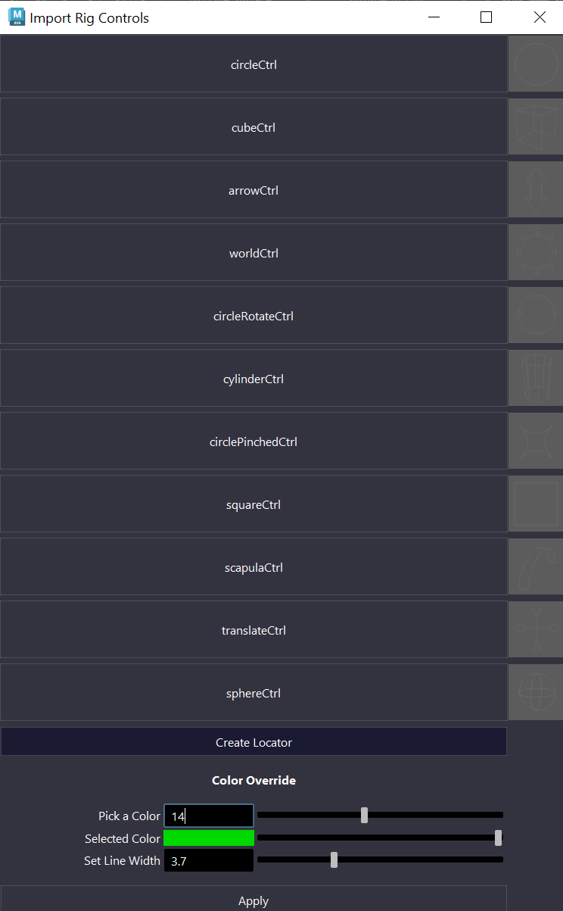
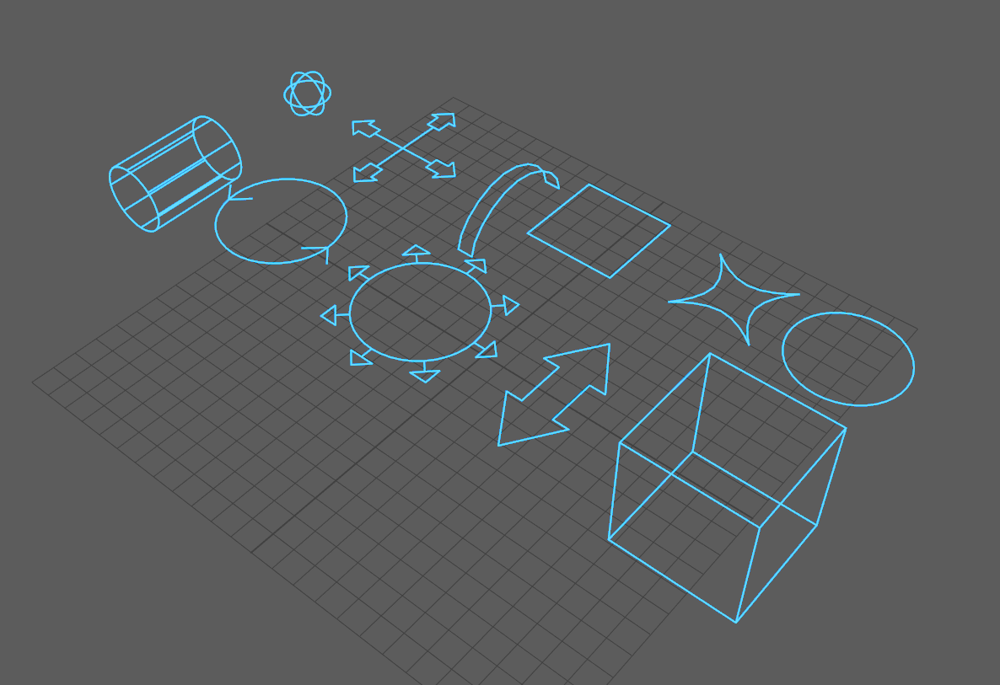

# Rig-Control-Library-Maya

A library of controls for importing into the project. Contains features such as setting multiple control colour and line width. Automatic locator creation on selected objects.

+ 

+ 
